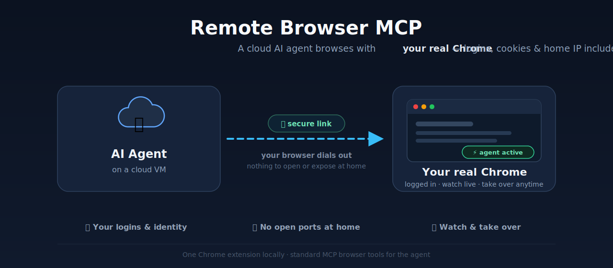

# Remote Browser MCP

Give an AI agent running on a remote VM control of a **real Chrome on your own machine** through the Model Context Protocol — reusing your real logins, cookies, extensions, and home IP, while you watch and take over at any time.

<p align="center">
  
</p>

Cloud browsers get blocked, fingerprinted, and logged out. Your own Chrome is already trusted everywhere — Remote Browser MCP simply lets your agent use it. The **only thing you install locally is a Chrome extension**. It dials *out* to the agent, so there are no inbound ports, no local tunnel, and no `--remote-debugging` flags on your machine. Set it up once, and any MCP-speaking agent can browse as *you* — while you literally watch it work in your own browser window.

Perfect for: personal automation agents (LinkedIn outreach, dashboards behind SSO, admin panels), research agents that need sites in your logged-in state, and any workflow where a headless datacenter browser just gets captcha-walled.

See [PRD.md](PRD.md) for the product rationale and [BRIDGE-SETUP.md](BRIDGE-SETUP.md) for the full deployment runbook.

## Features

- 🔐 **Browse as yourself** — the agent works inside your genuine Chrome profile: existing logins, cookies, sessions, extensions, and your home IP. No credential sharing, no re-authentication, no datacenter/bot fingerprint.
- 📡 **Outbound-only, token-authenticated** — the extension dials out over `wss://` and authenticates with a shared token. Zero inbound ports, zero local tunnels, zero debug flags on your machine.
- 🔌 **Standard MCP, Playwright-compatible tools** — one Streamable-HTTP MCP endpoint with tool names mirroring the official Playwright MCP (`browser_navigate`, `browser_snapshot`, `browser_click`, …). Works out of the box with Claude Code or any MCP client; agents written against Playwright MCP port over almost unchanged.
- 👀 **Live activity overlay** — a colored ring + status badge appears on the page whenever the agent acts, so you always know what it's doing. It self-clears the moment the agent goes idle.
- ✋ **Take over anytime** — it's your real browser window; just grab the mouse. An optional per-profile input-lock prevents you from *accidentally* fighting the agent mid-task, and always self-releases.
- 🤖 **Multi-agent, multi-profile** — run several Chrome profiles, each dialed into its own bridge. Every MCP session gets its own Chrome tab group, so parallel agents keep their work visually separate and never touch each other's tabs.
- 🧱 **Profile-level isolation** — a Chrome extension can only act within its own profile. Install it in one dedicated profile and the agent physically cannot reach your personal browsing.
- 🧪 **Snapshot-driven control** — the agent reads pages as accessibility trees with stable `[ref=eNN]` element ids, then clicks/types by ref. Faster and more reliable than pixel-hunting screenshots (screenshots are there too when needed).
- 🩺 **Self-healing & observable** — WebSocket heartbeat + `chrome.alarms` keepalive survive MV3 service-worker eviction, reconnect with backoff, and re-attach the debugger lazily. `/health`, `bridge_ping`, and `check_local_status` tell the agent whether a human/browser is actually there. Idle sessions are reaped automatically.
- 🪶 **Tiny footprint** — no Playwright install, no Node process, no daemon on your machine. One unpacked MV3 extension; everything else lives on the VM.

## How it works

There are two halves that meet over an authenticated WebSocket:

- **On the VM** — [`packages/bridge-server`](packages/bridge-server) exposes browser control to the agent as MCP and relays each command to the browser. It has two faces:
  - an **MCP** face on `localhost:3000/mcp` — the VM's Claude Code (or [`packages/agent`](packages/agent)) connects here and calls `browser_*` tools;
  - a **WebSocket** face on `localhost:3002` — the extension dials in and authenticates with a shared token. `cloudflared` running *on the VM* publishes this face at a `wss://` URL.
- **On your machine** — the [`packages/extension`](packages/extension) MV3 extension runs in a dedicated Chrome profile, dials out to that `wss://` URL, and drives a real tab with `chrome.debugger` (CDP).

```
   ┌──────────────────────── CLOUD VM ────────────────────────┐        ┌───────────── YOUR MACHINE ─────────────┐
   │  AI Agent  ──MCP──▶  bridge-server                        │        │  MV3 extension  (Aso Dara profile)     │
   │  (Claude Code /       ├─ MCP face  localhost:3000/mcp     │        │    │                                    │
   │   packages/agent)     └─ WS  face  localhost:3002 ◀───────┼── wss ─┼────┘  dials OUT, token-authenticated   │
   │                          published by cloudflared         │        │    chrome.debugger / CDP  ──▶  a tab   │
   └───────────────────────────────────────────────────────────┘        └────────────────────────────────────────┘
                                        ▲                                          nothing inbound on your machine
                                        └──────── agent never touches localhost; always over the network ─────────
```

Browser tool names **mirror the official [Playwright MCP](https://github.com/microsoft/playwright-mcp)**, so an agent (or contract) written against Playwright MCP works with almost no changes.

## Why not just…

| Alternative | What goes wrong |
|---|---|
| **A headless browser on the VM** | Fresh profile with no logins, a datacenter IP, and a bot fingerprint — captchas, blocks, and 2FA prompts everywhere. |
| **Chrome with `--remote-debugging-port`** | Chrome 136+ blocks it on your default profile, so you lose your real logins anyway — and you're running your browser with an open debug port. |
| **Tunneling into your machine** | Inbound access to your laptop (tunnel daemons, port forwarding, access policies) just to reach a browser. Here the browser dials *out* instead — there is nothing to reach. |
| **Sharing credentials with the agent** | Passwords and 2FA secrets in an agent's context. Here the agent gets a browser that is *already* signed in and never sees a credential. |

## Packages

| Path | What it is |
|---|---|
| [`packages/bridge-server`](packages/bridge-server) | VM-side bridge. MCP browser tools ⇄ WebSocket to the extension, with token auth, `/health`, and per-session tab tracking. Exposes `browser_*`, `check_local_status`, and `bridge_ping`. |
| [`packages/extension`](packages/extension) | The MV3 Chrome extension. Popup for Agent URL + token, a service worker holding one outbound WS per profile (heartbeat + `chrome.alarms` keepalive + reconnect backoff), and a `chrome.debugger` executor. |
| [`packages/agent`](packages/agent) | A standalone terminal agent — a stand-in for the VM's real client. Connects to the bridge and runs a tool-use loop. LLM is pluggable ([`src/llm`](packages/agent/src/llm)) — **Gemini** by default, Anthropic optional — with a no-API-key `smoke` test. |
| [`packages/daemon`](packages/daemon) | Legacy local MCP sidecar (presence + session notifications) from the pre-bridge architecture. Kept for reference; superseded by the bridge. |

## Browser tools

All exposed on the one bridge MCP endpoint, mirroring Playwright MCP names:

`browser_navigate` · `browser_snapshot` · `browser_click` · `browser_type` · `browser_press_key` · `browser_take_screenshot` · `browser_wait_for` · `browser_tab_list` · `browser_tab_new` · `browser_tab_select` · `browser_tab_close` · `check_local_status` · `bridge_ping`

`browser_snapshot` returns an accessibility tree whose interactable elements are tagged with `[ref=eNN]` ids; you pass those refs to `browser_click` / `browser_type`. Refs are only valid for that tab's latest snapshot, so re-snapshot after navigation or DOM changes.

## Prerequisites

- **Node.js 22+**
- **Google Chrome**
- **cloudflared** on the VM (`brew install cloudflared` / apt) — publishes the WebSocket face
- A shared token: `openssl rand -hex 32` — the same value goes on the VM and in the extension popup
- *(only for the standalone `packages/agent`)* a **Gemini API key** (`GEMINI_API_KEY`), or set `LLM_PROVIDER=anthropic` + `ANTHROPIC_API_KEY`

## Quick start

Three steps: run the bridge on the VM, load the extension in Chrome, verify. About ten minutes end to end.

```bash
npm install
npm run build
```

### 1 · VM — run the bridge

```bash
BRIDGE_ACCESS_TOKEN=<token> MCP_PORT=3000 WS_PORT=3002 \
  node packages/bridge-server/dist/index.js
# or under pm2:
BRIDGE_ACCESS_TOKEN=<token> pm2 start packages/bridge-server/dist/index.js --name rbm-bridge
```

Publish the WS face with `cloudflared` and point the VM's agent at the MCP face
(`http://localhost:3000/mcp`). Full ingress config and DNS notes are in
[BRIDGE-SETUP.md](BRIDGE-SETUP.md).

### 2 · Machine — load the extension (one dedicated profile)

1. Create a **dedicated Chrome profile** for the agent (e.g. "Aso Dara"), ideally an account-less local profile so Chrome sync can't copy the extension into or out of it.
2. `chrome://extensions` → **Developer mode** → **Load unpacked** → select [`packages/extension/`](packages/extension). Install it in **only** this profile, and turn **off** Extensions sync — that isolation is what keeps the agent off your other profiles.
3. Open the popup and set **Agent URL** (`wss://…/rbm-ws`) + **Access Token** (the token from step 1) → **Save & Connect**. Status should read *Connected to agent*.
4. Keep a window of that profile open whenever the agent may browse — **background is fine, focus is not required**. The first command attaches `chrome.debugger` and shows Chrome's "…started debugging this browser" bar; leave it in place.

### 3 · Verify end-to-end

```bash
# on the VM
curl -s localhost:3000/health          # → "extensionConnected":true
node packages/bridge-server/dist/test-client.js   # bridge_ping → "pong"
```

Or drive the whole path with the standalone agent's no-API-key check:

```bash
npm run smoke --workspace=packages/agent
```

## Development

```bash
npm run test:mock       # bridge round-trip against a fake-extension WS client
npm run test:profiles   # multi-profile / multi-session harness
npm run build --workspaces
```

Each package also has `dev` (tsx watch), `start`, and `typecheck` scripts.

## Security notes

- **Auth is an in-band token handshake** on the WebSocket — a browser can't send `CF-Access-*` headers, so the WS hostname must have no Cloudflare Access policy in front of it. The MCP face stays localhost-only on the VM and is never tunneled.
- **The extension is the trust boundary.** It can drive any tab in its profile via `chrome.debugger`; keep it in a dedicated profile with only the accounts the agent needs.
- **Keepalive is the known risk.** MV3 evicts idle service workers; the WS heartbeat keeps it resident and a 1-minute `chrome.alarms` revives it, re-attaching `chrome.debugger` lazily on the next command.
