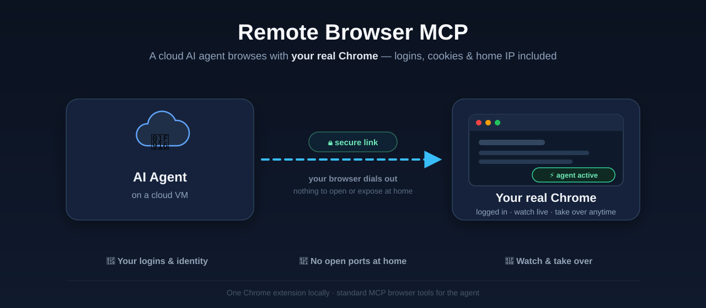

# Remote Browser MCP

Give an AI agent running on a remote VM control of a **real Chrome on your own machine** through the Model Context Protocol — reusing your real logins, cookies, extensions, and home IP, while you watch and take over at any time.

<p align="center">
  
</p>

Cloud browsers get blocked, fingerprinted, and logged out. Your own Chrome is already trusted everywhere — Remote Browser MCP simply lets your agent use it. The **only thing you install locally is a Chrome extension**. It dials *out* to the agent, so there are no inbound ports, no local tunnel, and no `--remote-debugging` flags on your machine. Set it up once, and any MCP-speaking agent can browse as *you* — while you literally watch it work in your own browser window.

Perfect for: personal automation agents (LinkedIn outreach, dashboards behind SSO, admin panels), research agents that need sites in your logged-in state, and any workflow where a headless datacenter browser just gets captcha-walled.

See [BRIDGE-SETUP.md](BRIDGE-SETUP.md) to put the agent on a different machine. [PRD.md](PRD.md) is kept as a historical record of the original design and no longer describes this code.

## Features

- 🔐 **Browse as yourself** — the agent works inside your genuine Chrome profile: existing logins, cookies, sessions, extensions, and your home IP. No credential sharing, no re-authentication, no datacenter/bot fingerprint.
- 📡 **Outbound-only, token-authenticated** — the extension dials out over `wss://` and authenticates with a shared token. Zero inbound ports, zero local tunnels, zero debug flags on your machine.
- 🔌 **Standard MCP, Playwright-compatible tools** — one Streamable-HTTP MCP endpoint with tool names mirroring the official Playwright MCP (`browser_navigate`, `browser_snapshot`, `browser_click`, …). Works out of the box with Claude Code or any MCP client; agents written against Playwright MCP port over almost unchanged.
- 👀 **Live activity overlay** — a colored ring + status badge appears on the page whenever the agent acts, so you always know what it's doing. It self-clears the moment the agent goes idle.
- ✋ **Take over anytime** — it's your real browser window; just grab the mouse. An optional per-profile input-lock prevents you from *accidentally* fighting the agent mid-task, and always self-releases.
- 🤖 **Multi-agent, multi-profile** — run several Chrome profiles, each dialed into its own bridge. Every MCP session gets its own Chrome tab group, so parallel agents keep their work visually separate and never touch each other's tabs.
- 🧱 **Profile-level isolation** — a Chrome extension can only act within its own profile. Install it in one dedicated profile and the agent physically cannot reach your personal browsing.
- 🧪 **Snapshot-driven control** — the agent reads pages as accessibility trees with stable `[ref=eNN]` element ids, then clicks/types by ref. Faster and more reliable than pixel-hunting screenshots (screenshots are there too when needed).
- 🩺 **Self-healing & observable** — WebSocket heartbeat + `chrome.alarms` keepalive survive MV3 service-worker eviction, reconnect with backoff, and re-attach the debugger lazily. `/health`, `bridge_ping`, and `check_local_status` tell the agent whether a human/browser is actually there. Idle sessions are reaped automatically.
- 🪶 **Tiny footprint** — no Playwright install, no Node process, no daemon on your machine. One unpacked MV3 extension; everything else lives on the VM.

## How it works

There are two halves that meet over an authenticated WebSocket:

- **On the VM** — [`packages/bridge-server`](packages/bridge-server) exposes browser control to the agent as MCP and relays each command to the browser. It has two faces:
  - an **MCP** face on `localhost:3000/mcp` — the VM's Claude Code (or [`packages/agent`](packages/agent)) connects here and calls `browser_*` tools. Requires `Authorization: Bearer $BRIDGE_MCP_TOKEN`;
  - a **WebSocket** face on `localhost:3002` — the extension dials in and authenticates with a shared token. `cloudflared` running *on the VM* publishes this face at a `wss://` URL.
- **On your machine** — the [`packages/extension`](packages/extension) MV3 extension runs in a dedicated Chrome profile, dials out to that `wss://` URL, and drives a real tab with `chrome.debugger` (CDP).

```
   ┌──────────────────────── CLOUD VM ────────────────────────┐        ┌───────────── YOUR MACHINE ─────────────┐
   │  AI Agent  ──MCP──▶  bridge-server                        │        │  MV3 extension  (agent profile)        │
   │  (Claude Code /       ├─ MCP face  localhost:3000/mcp     │        │    │                                    │
   │   packages/agent)     └─ WS  face  localhost:3002 ◀───────┼── wss ─┼────┘  dials OUT, token-authenticated   │
   │                          published by cloudflared         │        │    chrome.debugger / CDP  ──▶  a tab   │
   └───────────────────────────────────────────────────────────┘        └────────────────────────────────────────┘
                                        ▲                                          nothing inbound on your machine
                                        └──────── agent never touches localhost; always over the network ─────────
```

Browser tool names **mirror the official [Playwright MCP](https://github.com/microsoft/playwright-mcp)**, so an agent (or contract) written against Playwright MCP works with almost no changes.

## Why not just…

| Alternative | What goes wrong |
|---|---|
| **A headless browser on the VM** | Fresh profile with no logins, a datacenter IP, and a bot fingerprint — captchas, blocks, and 2FA prompts everywhere. |
| **Chrome with `--remote-debugging-port`** | Chrome 136+ blocks it on your default profile, so you lose your real logins anyway — and you're running your browser with an open debug port. |
| **Tunneling into your machine** | Inbound access to your laptop (tunnel daemons, port forwarding, access policies) just to reach a browser. Here the browser dials *out* instead — there is nothing to reach. |
| **Sharing credentials with the agent** | Passwords and 2FA secrets in an agent's context. Here the agent gets a browser that is *already* signed in and never sees a credential. |

## Packages

| Path | What it is |
|---|---|
| [`packages/bridge-server`](packages/bridge-server) | VM-side bridge. MCP browser tools ⇄ WebSocket to the extension, with token auth, `/health`, and per-session tab tracking. Exposes `browser_*`, `check_local_status`, and `bridge_ping`. **This is the self-host path**, and the only server in this repo — if you are running this for yourself, this is the one you want. A hosted service that wants its own transport adds one under `packages/extension/src/providers/`; see "Adding your own transport" below. |
| [`packages/extension`](packages/extension) | The MV3 Chrome extension. Popup for Agent URL + token, a service worker holding one outbound WS per profile (heartbeat + `chrome.alarms` keepalive + reconnect backoff), and a `chrome.debugger` executor. |
| [`packages/relay`](packages/relay) | **Side 2 of the hosted path.** One process holding one WebSocket per connected browser, so a product can address a Chrome on somebody's laptop. Presence and dispatch only — it is not an authorization boundary, and who a browser is comes from a pluggable auth provider (`ticket` or `token`). Published to npm as `remote-browser-relay`; `npm i -g remote-browser-relay` for the release, `@dev` for the pre-release. |
| [`packages/agent`](packages/agent) | A standalone terminal agent — a stand-in for the VM's real client. Connects to the bridge and runs a tool-use loop. LLM is pluggable ([`src/llm`](packages/agent/src/llm)) — **Gemini** by default, Anthropic optional — with a no-API-key `smoke` test (`npm run smoke --workspace=packages/agent`, against a running bridge). |

## Adding your own transport

The extension ships one way of reaching an agent — the self-hosted `bridge` above. A product that
wants its own (its own sign-in, its own server, its own rules about who may drive a browser) adds
a **transport** rather than editing the worker.

```
packages/extension/src/
  sw.js                    Chrome's plumbing, and nothing else. Never edit this in a fork.
  executor.js              CDP. Core.
  page-scripts.js          what runs inside the page. Core.
  connection.js            one WebSocket to one bridge. Core.
  popup.js / popup.html    the popup SHELL. Never edit these in a fork either.
  providers/
    registry.js            the worker's fan-out. Core.
    panels.js              ← one line a fork adds (the popup)
    index.js               ← one line a fork adds (the worker)
    bridge/
      index.js             the self-hosted transport
      popup.js             its panel
    <yours>/               ← the directory a fork adds
```

There are TWO registration points, and they are separate on purpose: `providers/index.js` lists
TRANSPORTS for the service worker, `providers/panels.js` lists PANELS for the popup. One list would
drag the CDP driver into a window that only draws buttons, on every popup open.

A transport is a plain object with optional methods — `reconcile`, `onDetach`, `onTabRemoved`,
`status`, `onMessage`, `reconnectAll`, `teardown`. A panel has `name`, `mount(root)` and
`render(snapshot)`, and **owns its own markup**: the shell hands it an empty `<section>` and
`popup.html` stays core. `registry.js` and `panels.js` document both shapes. Two rules make it
work:

- **Return `undefined` from `onMessage` for anything that is not yours.** The first transport to
  return anything else claims the message and the rest never see it, because Chrome allows exactly
  one reply.
- **Contribute a `status()` that does not collide.** The keys are shallow-merged, and `profiles`
  already belongs to the bridge.

One transport cannot break another: every call is isolated, so a half-finished transport is a
transport that does not work rather than an extension that does not work. `npm run test:registry`
covers that, among other things.

**A fork should never need to touch `sw.js`, `popup.js`, `popup.html`, `executor.js`,
`page-scripts.js` or `connection.js`.** That is what keeps `git merge upstream/main` clean. If the seam will not stretch far enough for
what you are building, open an issue — it is young and it is meant to move.

## Browser tools

All exposed on the one bridge MCP endpoint, mirroring Playwright MCP names:

`browser_navigate` · `browser_snapshot` · `browser_click` · `browser_type` · `browser_select_option` · `browser_press_key` · `browser_take_screenshot` · `browser_wait_for` · `browser_tab_list` · `browser_tab_new` · `browser_tab_select` · `browser_tab_close` · `check_local_status` · `bridge_ping`

`browser_snapshot` returns an accessibility tree whose interactable elements are tagged with `[ref=eNN]` ids; you pass those refs to `browser_click` / `browser_type`. Refs are only valid for that tab's latest snapshot, so re-snapshot after navigation or DOM changes.

Two arguments keep a big page from costing a whole snapshot: `find` returns only the lines containing some text, and `ref` returns only one element's line. Both filter what comes **back**, not what is reachable — every element still gets a ref, so one you were not shown still works. A miss says how big the page was, so an empty answer never looks like an empty page.

`browser_select_option` is for a real `<select>` only. It sets the property and fires `input` + `change`, because the list a `<select>` opens is drawn by the operating system and no synthetic click can reach it. A dropdown a site built out of `<div>`s is not a `<select>` — the tool says so, and that one is clicked like anything else.

## Prerequisites

- **Node.js 22+** (`.nvmrc` pins 22.22.3)
- **Google Chrome**
- *(only if the agent runs on a different machine)* **cloudflared** or any other way to publish one
  WebSocket port — see [BRIDGE-SETUP.md](BRIDGE-SETUP.md). Not needed to try this.
- *(only for the standalone `packages/agent`)* a **Gemini API key** (`GEMINI_API_KEY`), or set `LLM_PROVIDER=anthropic` + `ANTHROPIC_API_KEY`

## Quick start

**Start on one machine.** The agent and the browser can be on the same box, and everything below
works with no VM, no tunnel and no DNS. Put it on a VM once you have watched it drive your Chrome —
that is [BRIDGE-SETUP.md](BRIDGE-SETUP.md), and it changes one URL.

```bash
git clone https://github.com/navidshad/remote-browser-mcp
cd remote-browser-mcp
npm install
npm run build
```

### 1 · Run the bridge

Two tokens, and they must differ — the bridge refuses to start otherwise. They authenticate two
different parties: the extension to the WebSocket face, the agent to the MCP face.

```bash
export BRIDGE_ACCESS_TOKEN=$(openssl rand -hex 32)
export BRIDGE_MCP_TOKEN=$(openssl rand -hex 32)
node packages/bridge-server/dist/index.js
# MCP face → http://127.0.0.1:3000/mcp   (loopback)
# WS  face → ws://0.0.0.0:3002           (the extension dials in here)
```

### 2 · Load the extension, in one dedicated profile

1. Create a **dedicated Chrome profile** for the agent, ideally an account-less local profile so Chrome sync can't copy the extension into or out of it.
2. `chrome://extensions` → **Developer mode** → **Load unpacked** → select [`packages/extension/`](packages/extension). Install it in **only** this profile, and turn **off** Extensions sync — that isolation is what keeps the agent off your other profiles.
3. Open the popup → **+ Add profile**. **Agent URL** is `ws://localhost:3002` on one machine (`wss://…` once it is behind a tunnel); **Access Token** is your `BRIDGE_ACCESS_TOKEN`. Press **Save**. The status line should read *Connected*.
4. Keep a window of that profile open whenever the agent may browse — **background is fine, focus is not required**. The first command attaches `chrome.debugger` and shows Chrome's "…started debugging this browser" bar; leave it in place.

### 3 · Point an agent at it

```bash
claude mcp add --transport http browser http://127.0.0.1:3000/mcp \
  --header "Authorization: Bearer $BRIDGE_MCP_TOKEN"
claude mcp list      # browser → ✓ Connected
```

Then ask it to open a page. You should watch it happen in your own window.

### Verify

Two useful checks, and they answer different questions.

```bash
npm run test:mock    # the whole path — real bridge, real Executor, real MCP clients, mocked Chrome
```

That needs nothing running and no tokens: it spawns its own bridge and proves the server half works
on this machine. If it passes and your popup still will not connect, the problem is the extension,
the profile or the token — not the build.

```bash
curl -s localhost:3000/health          # → {"status":"ok",…} — liveness, no credential needed
curl -s localhost:3000/status -H "Authorization: Bearer $BRIDGE_MCP_TOKEN"   # → "extensionConnected":true
BRIDGE_MCP_TOKEN=$BRIDGE_MCP_TOKEN node packages/bridge-server/dist/test-client.js   # bridge_ping → "pong"
```

Those ask the bridge you are actually running whether your Chrome has arrived.

`/health` is deliberately thin. It used to report whether a browser was attached, how many tabs it
held and which sessions were live — a description of a specific person's Chrome, served to anyone
who could reach the port. That moved to `/status`, behind the token; `/health` stays anonymous
because a tunnel health check has no credential.

## Releases

**One release per merge to `main`, covering every package.** A release here is a snapshot of the
repo: it always states where *all* packages stand, so you can tell which extension goes with which
relay. The extension zip is attached every time, even when the change was elsewhere — the latest
release must always be somewhere you can download a working extension from.

What is skipped is the *publishing*, not the release: `scripts/resolve-versions.mjs` path-filters
each package independently, so a relay-only change does not republish an identical extension. If
nothing changed anywhere, no release is cut.

| Package | Where it goes | How to get it |
|---|---|---|
| Chrome extension | attached to the GitHub Release | download, unzip, load unpacked |
| `remote-browser-relay` | npm | `npm i -g remote-browser-relay` |

`dev` publishes the relay as a prerelease on npm's `dev` tag (`npm i -g remote-browser-relay@dev`)
and cuts **no** GitHub Release — a pre-release is for whoever asked for it by name.

```bash
npm test              # everything CI gates on — one command, same result
npm run versions      # what the next release would be, and why
```

**One workflow run per merge.** CI runs on pull requests and gates the merge; Release runs on a push
to `main` and decides what ships. They used to both run on main, running the same suite twice
against the same commit.

`npm test` runs exactly what CI gates on, and `npm run test:ci-parity` proves it by reading both
files — so a step added to `ci.yml` and not to `npm test` fails immediately, rather than the next
time somebody trusts a green laptop.

The workflow is **four jobs, not four files**, and that is deliberate. A release has to list where
*all* packages stand, so something must see every outcome at once — across separate workflow files
that means `workflow_run` chaining, which reintroduces "which commit is this about" and is where
release pipelines quietly ship the wrong thing. Jobs give the same separation with `needs` doing
the coordination:

```
resolve  ──┬──▶ relay      (npm, only if packages/relay changed)
           ├──▶ extension  (stamp + zip per build, always)
           └──────────────▶ publish  (one GitHub Release, from both outcomes)
```

**A failure is scoped to its package.** A relay publish that fails does not stop the extension
being built and released — the release says so instead, in the table. Anything other than an
outright success is reported as not published, because a release naming a version npm does not
have is worse than a red build.

### Release variants — more than one build from one tree

A fork that runs a development and a production backend needs the same extension twice: pointed at
two endpoints, installed side by side under two names. Two branches that differ in one file would
conflict at every merge, and a fork must not edit `release.yml`, which it inherits byte for byte.
So the builds are **declared** in the root `package.json`:

```json
"extensionVariants": [
  { "id": "dev",  "manifest": { "name": "Acme Browser (Dev)" },
                  "env": { "endpoint": "https://dev.example.com" } },
  { "id": "prod", "env": { "endpoint": "https://example.com" } }
]
```

| | What happens |
|---|---|
| No `extensionVariants` | One zip, `extension-<version>.zip` — exactly what this repository ships. |
| `manifest` | Deep-merged into that build's copy of `manifest.json`. `version` is refused: the release stamps it. |
| `env` | Written into that build's copy of `packages/extension/src/build-env.js` as `BUILD_ENV`. The committed file is empty, so a checkout falls back to your own defaults. |
| Each build | Its own zip, `extension-<version>-<id>.zip`, attached to the same release. |

An unknown key, a bad id or a duplicate one fails `npm test` (`test:package` validates your own
declaration), because ignoring a typo would ship the default build under the variant's name. Try it
locally with `node scripts/package-extension.mjs --out /tmp/zips`.

### Versions are derived, never typed

From conventional-commit subjects: `feat` is a minor, a `!` or a `BREAKING CHANGE:` footer is a
major, everything else is a patch. Two rules are load-bearing:

- **The path filter decides *whether* to release; the type only decides *how big*.** Any commit
  touching a package's own paths releases it. An unrecognised type — `chore`, `ci`, `refactor`, an
  unparseable subject — falls through to a PATCH rather than to "no release". The conventional way
  round, where only `feat`/`fix` release, means a `refactor(relay):` that changes the shipped bundle
  publishes nothing and reports success.
- **While the major is 0, a breaking change bumps the MINOR** rather than jumping to 1.0.0.
  Reaching 1.0.0 should be somebody's decision.

**Two packages, two boundaries**, and the difference is not an inconsistency. The relay's is npm's
own `gitHead` for the published version — it cannot drift from what was actually published, which a
tag can. The extension is published to no registry, so an `extension-v*` git tag *is* its record,
pushed only after the release succeeded.

## Development

```bash
npm run test:mock        # bridge round-trip against a fake-extension WS client
npm run test:profiles    # multi-profile / multi-session harness
npm run test:registry    # the extension's transport fan-out, plus the real bridge transport
npm run test:popup       # the popup shell and its panels, against a real DOM
npm run test:snapshot    # browser_snapshot's find/ref narrowing, against the real page script
npm run test:select      # browser_select_option, against the real page script
npm run build --workspaces
```

The last three need no bridge and no browser. `test:snapshot` and `test:select` import the page
script's own functions and run them against a stub DOM, so a change to matching, or to the events a
`<select>` fires, is caught in milliseconds. `test:registry` drives the service worker's fan-out
with fake transports and then with the real one.

What none of them can see is a real page: CDP, a real framework's own event handling, and a
dropdown a site drew itself out of `<div>`s. **Loading the extension in Chrome is part of the loop,
not an optional extra.**

Each package also has `dev` (tsx watch), `start`, and `typecheck` scripts.

## Security notes

- **Two tokens, and they must differ.** `BRIDGE_ACCESS_TOKEN` authenticates the extension dialling in; `BRIDGE_MCP_TOKEN` authenticates the agent asking for work. The bridge refuses to start if you set them to the same value — one is typed into a popup on a laptop, the other pasted into an agent config, so they leak through different accidents, and sharing one would mean a leaked agent token also lets the holder impersonate the extension and take over the browser.
- **The WS face authenticates in-band**, as the first frame — a browser WebSocket cannot send `CF-Access-*` headers, so the WS hostname must have no Cloudflare Access policy in front of it. Every frame after that handshake is schema-validated and size-bounded (`protocol.ts`); the socket itself caps one frame at 12 MB.
- **The MCP face requires a bearer token** and binds to loopback by default. It used to have no authentication at all, on the reasoning that loopback was the boundary — which holds until one tunnel ingress rule exists, and was never a boundary between *users* on a shared box. Set `BRIDGE_BIND_HOST` if you genuinely mean to expose it; the token is then the only thing in front of a fully logged-in Chrome.
- **Sessions are mandatory.** Every call is routed to the tab group its MCP session owns, so a request that names no session is refused rather than being run against a shared "default".
- **The extension is the trust boundary.** It can drive any tab in its profile via `chrome.debugger`; keep it in a dedicated profile with only the accounts the agent needs.
- **Keepalive is the known risk.** MV3 evicts idle service workers; the WS heartbeat keeps it resident and a 1-minute `chrome.alarms` revives it, re-attaching `chrome.debugger` lazily on the next command.

## License

[Apache-2.0](LICENSE). Use it, change it, sell it, fork it and ship your own build.

The one thing the licence does not give you is the **name**. Section 6 grants no rights to trade names, trademarks or product names, beyond describing where the code came from. So a fork is free to exist and free to be commercial, and must not present itself as this project. That is on purpose: it means customising is a fork, not a plugin system built to keep branding out of your hands.

This repo asks you to trust it with a logged-in browser. Reading it before you install it is the point, and a licence is what makes reading it useful.
